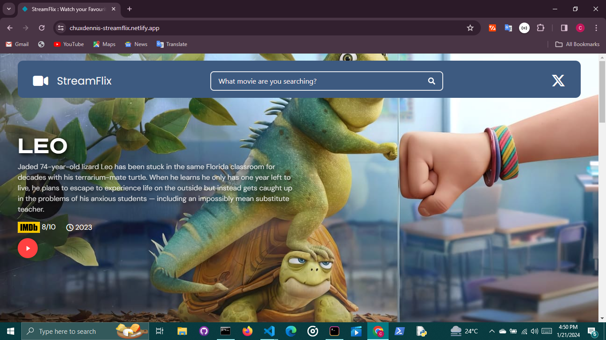

# [StreamFlix](chuxdennis-streamflix.netlify.app)



**_StreamFlix is web app made to search for your favourite movies and TV shows . StreamFlix was built using [React.js(with vite)](vitejs.dev) for improved user interface and interactivity. Use StreamFlix today to view more details and watch trailers of your favouite movies _**

## Table of Contents

- [About](#about)
- [Features](#features)
- [Built With](#built-with)
- [Getting Started](#getting-started-with-this-repo)
- [Prerequsites](#prerequsites)
- [Installation](#installationn)
- [Usage](#usage)
- [Deployment](#deployment)
- [Contribution](#contributions-and-feedback)
- [License](#license)
- [Contact](#contact)

## About

StreamFlix, a web app built to gain access to details of your favourite movies and TV shows.Additionaly, you can also watch your favourite trailers on StreamFlix too.

## Features

1. Fully responsive across all devices of any sizes.
2. Minimal web design to enhance interactivity and search.
3. StreamFlix was built entirely built with React.

## Built With

1. [Tailwind CSS](tailwindcss.com) - To handle responsiveness and interactivity.
2. [React(with vite)](vitejs.dev)- For UI handling & compostion , state management and overall structure.
3. [Remix Icons](remixicon.com) - For web SVGs used on the site.
4. [Font Awesome]() - For web icons used on the site.

# Getting started with this repo

The following stated instructions below should be followed carefully for the successful cloning and tweaking of this repo.

### Prerequsites

- Git - Git must be installed on your local system in order to clone this repo.
- Node(NPM) - Node should installed on your local machine in order to use NPM
- Vite

### Installation

1. Clone this repository

```bash
   cd path git clone https://github.com/Chux-Dennis/StreamFlix.git
```

2. Install the required dependecies

```bash
npm install
```

3. Kick start your local server

```bash
 npm run dev
```

### Usage

As stated earlier , StreamFlix aids search on your favourite movies and Tv shows

### Deployment

StreamFlix is currnetly live on an official third-party server.
Visit StreamFlix official site : [https://chuxdennis-streamflix.netlify.app](https://chuxdennis-streamflix.netlify.app)

## Contributions and feedback

We all love Open Source :) ❤❤ .Contributions are what make the open source community such an amazing place to learn, inspire, and create.
Do well to push feedbacks on [Twitter](https://twitter.com/chuxdennis). I am currently open to collaborations , feel free to contact me too.

## License

Distributed under the MIT License. See [`LICENSE`](LICENSE) for more information.

## Resources

- [Canva](canva.com)
- [Github](github.com)
- [Axios](axios)

## Acknowledgement

All sole acknowledge goes to my **team** and the Github Open Source Community.
